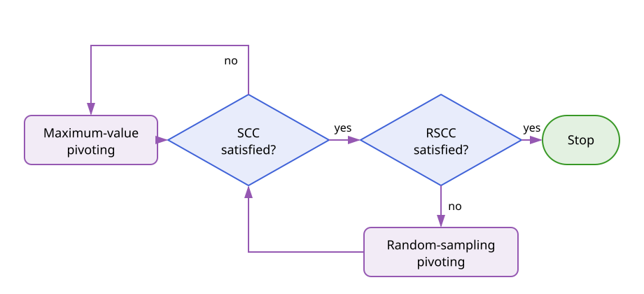

# Adaptive Cross Approximation

Adaptive Cross Approximation (ACA) constructs a low-rank approximation from a
small number of rows and columns of a matrix. This section introduces the
factorization, the pivoting strategies, and the convergence criteria independently
of the operator that produced the matrix [[1, 3, 6]](@ref refs).

## Low-Rank Factorization

Let

```math
\boldsymbol{\mathsf A} \in \mathbb{K}^{m \times n},
\qquad \mathbb{K} \in \{\mathbb{R},\mathbb{C}\}.
```

After $k$ iterations, ACA represents $\boldsymbol{\mathsf A}$ by

```math
\widetilde{\boldsymbol{\mathsf A}}_k
= \boldsymbol{\mathsf U}_k \boldsymbol{\mathsf V}_k
= \sum_{\ell=1}^{k} \boldsymbol u_\ell \boldsymbol v_\ell^{\mathsf T},
```

where
$\boldsymbol{\mathsf U}_k = [\boldsymbol u_1,\ldots,\boldsymbol u_k]
\in \mathbb{K}^{m\times k}$ and
$\boldsymbol{\mathsf V}_k = [\boldsymbol v_1,\ldots,\boldsymbol v_k]^{\mathsf T}
\in \mathbb{K}^{k\times n}$. The corresponding residual matrix is

```math
\boldsymbol{\mathsf R}_k
= \boldsymbol{\mathsf A}
- \widetilde{\boldsymbol{\mathsf A}}_k,
\qquad
\boldsymbol{\mathsf R}_0 = \boldsymbol{\mathsf A}.
```

Only selected rows and columns of $\boldsymbol{\mathsf A}$ are evaluated. Given a
row index $i_k$, the $k$th step evaluates the residual row

```math
\widehat{\boldsymbol v}_k^{\mathsf T}
= \boldsymbol{\mathsf A}[i_k,:]
- \sum_{\ell=1}^{k-1} u_\ell(i_k)\boldsymbol v_\ell^{\mathsf T}.
```

A column index $j_k$ is selected from this row and the pivot is
$p_k=\widehat v_k(j_k)$. For $p_k\neq0$, the new factors are

```math
\boldsymbol v_k^{\mathsf T}
= \frac{\widehat{\boldsymbol v}_k^{\mathsf T}}{p_k},
\qquad
\boldsymbol u_k
= \boldsymbol{\mathsf A}[:,j_k]
- \sum_{\ell=1}^{k-1} v_\ell(j_k)\boldsymbol u_\ell.
```

Consequently, the selected residual row and column vanish after the rank-one
update. If $\boldsymbol{\mathsf A}$ has exact rank $r$ and no zero pivot is
encountered, the residual is zero after $r$ steps. [`ACA`](@ref) performs this
row-first procedure; [`ACAᵀ`](@ref) is its column-first transpose dual.

For a numerical rank $k \ll \min(m,n)$, the factors require
$k(m+n)$ entries. With partial pivoting, their construction requires
$\mathcal{O}(k^2(m+n))$ arithmetic operations and only
$\mathcal{O}(k(m+n))$ entries of the original matrix are evaluated
[[1, 3]](@ref refs).

## Pivoting Strategies

The rank-one construction is fixed by the selected pivot pairs $(i_k,j_k)$.
Pivoting strategies differ in how they obtain these indices without assembling the
complete residual matrix.

### Full Pivoting

The ideal algebraic choice is the largest entry of the complete residual:

```math
(i_k,j_k)
= \operatorname*{arg\,max}_{\substack{i\notin I_{k-1}\\j\notin J_{k-1}}}
  \left|[\boldsymbol{\mathsf R}_{k-1}]_{ij}\right|,
```

where $I_{k-1}=\{i_1,\ldots,i_{k-1}\}$ and
$J_{k-1}=\{j_1,\ldots,j_{k-1}\}$. This gives a strong pivot but requires access
to all remaining residual entries. It therefore loses the main advantage of ACA
when matrix entries are expensive to evaluate. [`FullPivoting`](@ref) implements
this reference strategy for an already assembled dense matrix.

### Partial Pivoting

[`MaximumValue`](@ref) implements the standard partial-pivoting strategy. Given
$i_k$, it selects

```math
j_k
= \operatorname*{arg\,max}_{j\notin J_{k-1}}
  \left|[\boldsymbol{\mathsf R}_{k-1}]_{i_kj}\right|.
```

After the corresponding residual column has been evaluated, the next row is

```math
i_{k+1}
= \operatorname*{arg\,max}_{i\notin I_k}
  \left|[\boldsymbol{\mathsf R}_{k-1}]_{ij_k}\right|.
```

Thus, every search is restricted to one already evaluated row or column. Partial
pivoting is inexpensive and is the default strategy. It is not globally
rank-revealing, however: a small update only describes the currently visited part
of the residual and does not prove that the complete residual is small.

For example, consider a matrix with the block structure

```math
\boldsymbol{\mathsf A}
=
\begin{pmatrix}
\boldsymbol{\mathsf 0} & \boldsymbol{\mathsf A}_{12}\\
\boldsymbol{\mathsf A}_{21} & \boldsymbol{\mathsf 0}
\end{pmatrix}.
```

Starting in one block, partial pivoting may continue selecting rows and columns
from that block while leaving the other nonzero block undiscovered. The latest
rank-one update can then become small even though the complete residual is not.
Geometry-based and sampled-residual pivots address these two aspects separately
[[6]](@ref refs).

### Fill-Distance Pivoting

Geometry-based pivoting associates every candidate index $i$ with a point
$\boldsymbol x_i$ in a set $X$. For the points $X_{I_k}$ selected up to iteration
$k$, the fill distance is

```math
h_{X_{I_k},X}
= \sup_{\boldsymbol x\in X}
  \operatorname{dist}(\boldsymbol x,X_{I_k})
= \sup_{\boldsymbol x\in X}
  \min_{\boldsymbol y\in X_{I_k}}
  \lVert\boldsymbol x-\boldsymbol y\rVert_2.
```

Standard fill-distance pivoting chooses the candidate that minimizes the fill
distance after it is added:

```math
i_k
= \operatorname*{arg\,min}_{i\notin I_{k-1}}
  h_{X_{I_{k-1}\cup\{i\}},X}.
```

If several candidates attain the same minimum, the residual values can be used as
a tie-breaker [[6]](@ref refs). [`FillDistance`](@ref) implements the geometric
selection. It distributes pivots across the underlying geometry and is paired with
partial pivoting in the opposite direction [[5, 6]](@ref refs).

The modified fill-distance strategy avoids solving the minimization problem above.
The initial point may be chosen closest to the centroid of $X$. For $k>1$, it
selects the point farthest from the current pivot set:

```math
i_k
= \operatorname*{arg\,max}_{i\notin I_{k-1}}
  \min_{\ell<k}
  \lVert\boldsymbol x_i-\boldsymbol x_{i_\ell}\rVert_2.
```

The distances can be updated in linear time after every pivot. This strategy is
available as [`Leja2`](@ref); despite its historical name in the package, this is
the modified fill-distance rule used in the ACA context [[2, 6]](@ref refs).

### Random-Sampling Pivoting

Random-sampling pivoting reuses the entries monitored by the random-sampling
convergence criterion. Let

```math
S=\{(\rho_q,\gamma_q):q=1,\ldots,M\}
```

be the sampled row-column pairs, and let
$e_k(q)=[\boldsymbol{\mathsf R}_k]_{\rho_q\gamma_q}$ be their residuals after
iteration $k$. The sample with the largest remaining error is

```math
q_k=\operatorname*{arg\,max}_{1\leq q\leq M}|e_{k-1}(q)|.
```

Depending on which direction is being selected, the next index is either
$i_k=\rho_{q_k}$ or $j_k=\gamma_{q_k}$. This directs the algorithm toward an
observed error that ordinary partial pivoting has not found. The strategy is
implemented by
[`AdaptiveCrossApproximation.RandomSamplingPivoting`](@ref) and must share its
state with an [`AdaptiveCrossApproximation.RandomSampling`](@ref) criterion
[[4, 6]](@ref refs).

### Combining Pivoting Strategies

No single inexpensive pivoting strategy is uniformly best. A useful combination
starts with partial pivoting and switches to random-sampling pivoting once the
standard convergence criterion is satisfied but sampled residuals remain too
large. [`AdaptiveCrossApproximation.CombinedPivStrat`](@ref) couples this switch to
the state of [`AdaptiveCrossApproximation.CombinedConvCrit`](@ref).



The fill-distance strategies provide an alternative way to force geometrically
distributed pivots when the matrix structure is known to make partial pivoting
unreliable. They should be used in only one direction and combined with
maximum-value pivoting in the other direction [[5, 6]](@ref refs).

## Convergence Criteria

### Exact Residual Criterion

For a requested relative tolerance $\varepsilon$, the desired condition is

```math
\lVert\boldsymbol{\mathsf R}_k\rVert_{\mathrm F}
\leq
\varepsilon\lVert\boldsymbol{\mathsf A}\rVert_{\mathrm F}.
```

Evaluating this condition requires the complete matrix and residual. Practical ACA
criteria therefore estimate the two norms from quantities already sampled during
the factorization.

### Standard Convergence Criterion

The standard convergence criterion (SCC) treats the latest rank-one update as an
estimate of the residual norm and the current approximation as an estimate of the
matrix norm. It stops when

```math
\lVert\boldsymbol u_k\rVert_2\lVert\boldsymbol v_k\rVert_2
\leq
\varepsilon
\lVert\widetilde{\boldsymbol{\mathsf A}}_k\rVert_{\mathrm F}.
```

The norm of the approximation is updated without forming a dense matrix:

```math
\begin{aligned}
\lVert\widetilde{\boldsymbol{\mathsf A}}_k\rVert_{\mathrm F}^2
={}&\lVert\widetilde{\boldsymbol{\mathsf A}}_{k-1}\rVert_{\mathrm F}^2
+\lVert\boldsymbol u_k\rVert_2^2\lVert\boldsymbol v_k\rVert_2^2\\
&+2\operatorname{Re}\!\left(
\sum_{\ell=1}^{k-1}
(\boldsymbol u_\ell^*\boldsymbol u_k)
(\boldsymbol v_\ell^*\boldsymbol v_k)
\right).
\end{aligned}
```

This is [`FNormEstimator`](@ref). The SCC is inexpensive, but its residual estimate
can be too optimistic because the latest update depends on the path taken by the
pivoting strategy [[1, 3, 4, 6]](@ref refs).

### Random-Sampling Convergence Criterion

Before the ACA iteration begins, choose $M$ matrix indices uniformly and initialize

```math
e_0(q)=[\boldsymbol{\mathsf A}]_{\rho_q\gamma_q},
\qquad q=1,\ldots,M.
```

The sampled residuals are updated with every rank-one term,

```math
e_k(q)
=e_{k-1}(q)-u_k(\rho_q)v_k(\gamma_q).
```

Because the sample mean of $|e_k(q)|^2$ estimates the mean squared entry of the
complete residual, its Frobenius norm is estimated by

```math
\widehat r_k
=\sqrt{mn\,\frac{1}{M}\sum_{q=1}^{M}|e_k(q)|^2}.
```

The random-sampling convergence criterion (RSCC) is satisfied when

```math
\widehat r_k
\leq
\varepsilon
\lVert\widetilde{\boldsymbol{\mathsf A}}_k\rVert_{\mathrm F}.
```

Unlike the SCC, this criterion samples the residual globally. Its estimate is
statistical, and its reliability depends on both the number and distribution of
the samples. [`AdaptiveCrossApproximation.RandomSampling`](@ref) implements this
criterion [[4, 6]](@ref refs).

### Combined Convergence Criterion

The combined convergence criterion (CCC) requires both the SCC and the RSCC:

```math
\max\!\left(
\lVert\boldsymbol u_k\rVert_2\lVert\boldsymbol v_k\rVert_2,
\widehat r_k
\right)
\leq
\varepsilon
\lVert\widetilde{\boldsymbol{\mathsf A}}_k\rVert_{\mathrm F}.
```

Equivalently, compression stops only when every constituent criterion is
satisfied. This is the role of
[`AdaptiveCrossApproximation.CombinedConvCrit`](@ref). Together with the combined
pivoting strategy above, the SCC controls the initial maximum-value phase and the
RSCC prevents termination while a significant sampled residual remains. This is
the robust configuration recommended for integral-equation matrices containing
double-layer contributions or whenever standard ACA may terminate prematurely
[[6]](@ref refs).

### Extrapolated Convergence

[`FNormExtrapolator`](@ref) supplements the standard norm test with the history

```math
d_k=\lVert\boldsymbol u_k\rVert_2\lVert\boldsymbol v_k\rVert_2.
```

When the SCC first appears satisfied, a quadratic polynomial $P_2$ is fitted to a
monotonically decreasing subset of $(\ell,\log_{10}d_\ell)$. Convergence is accepted
only if

```math
P_2(k)
\leq
\log_{10}\!\left(
\varepsilon
\lVert\widetilde{\boldsymbol{\mathsf A}}_k\rVert_{\mathrm F}
\right).
```

The extrapolation suppresses termination caused by an isolated small update. Its
main role in this package is the incomplete ACA; see
[Incomplete Adaptive Cross Approximation](iaca.md) for that setting.

For construction and usage examples, see
[Using Adaptive Cross Approximation](../manual/aca.md).
