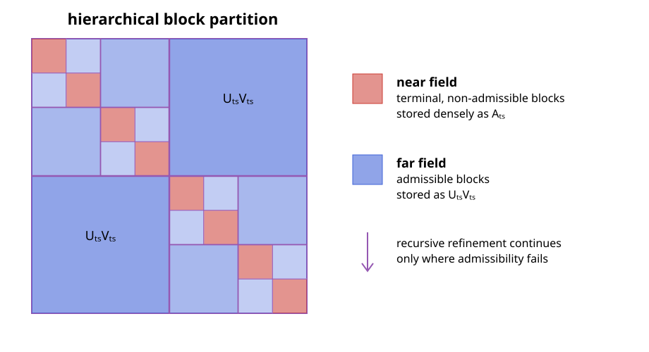

# Hierarchical Matrices

A hierarchical matrix, or $\mathcal{H}$-matrix, represents a dense matrix by a
hierarchy of small dense near-field blocks and low-rank far-field blocks. For
matrices arising from integral equations, this reflects the different behavior of
the kernel at short and long distances: nearby interactions may be singular or
rapidly varying, whereas well-separated interactions are usually smooth and
compressible [[1, 3, 6]](@ref refs).

## Cluster Trees and Block Trees

Let

```math
\boldsymbol{\mathsf A}\in\mathbb{K}^{M\times N},
\qquad
\mathcal I=\{1,\ldots,M\},
\quad
\mathcal J=\{1,\ldots,N\}.
```

A cluster tree $\mathcal T_{\mathcal I}$ recursively partitions the row-index set.
Its root is $\mathcal I$, and the children of every non-leaf cluster $t$ form a
disjoint partition of $t$. A second tree $\mathcal T_{\mathcal J}$ organizes the
column indices in the same way. Each cluster is associated with a geometrical
support $\Omega_t$ containing the positions of its degrees of freedom.

The Cartesian product of the two cluster trees defines a block tree. A block
$b=t\times s$ represents the submatrix

```math
\boldsymbol{\mathsf A}_{ts}
=\boldsymbol{\mathsf A}[t,s]
\in\mathbb{K}^{|t|\times|s|}.
```

Starting with $\mathcal I\times\mathcal J$, the block tree recursively subdivides
cluster pairs until they are either geometrically admissible or cannot be refined
further. Its leaves form a disjoint matrix partition

```math
\mathcal P
=\mathcal P_{\mathrm{near}}\mathbin{\dot\cup}
 \mathcal P_{\mathrm{far}}.
```

## Geometric Admissibility

A strong admissibility condition declares $t\times s$ a far-field block when

```math
\max\!\left(
\operatorname{diam}(\Omega_t),
\operatorname{diam}(\Omega_s)
\right)
\leq
\eta\,\operatorname{dist}(\Omega_t,\Omega_s).
```

The condition compares the size of both clusters with their separation. In the
H2Trees backend, the supports are bounding balls or boxes, and the distance is the
gap between them. With the convention above, increasing $\eta$ makes the test
easier to satisfy: more blocks enter the far field, including less strongly
separated interactions that may require a larger numerical rank.

If a pair is not admissible, it is subdivided. A non-admissible pair that reaches a
terminal cluster becomes a near-field block and is stored densely. The resulting
recursive structure is illustrated below; the exact pattern depends on the
geometry rather than only on the matrix indices.



## Blockwise Low-Rank Approximation

For a block partition $\mathcal P$ and maximum far-field rank $k$, the associated
hierarchical matrix class is

```math
\mathcal H(\mathcal P,k)
=
\left\{
\boldsymbol{\mathsf M}\in\mathbb{K}^{M\times N}:
\operatorname{rank}(\boldsymbol{\mathsf M}[t,s])\leq k
\ \text{for all}\ t\times s\in\mathcal P_{\mathrm{far}}
\right\}.
```

No rank restriction is imposed on the near-field blocks [[1]](@ref refs).
For every far-field block $t\times s\in\mathcal P_{\mathrm{far}}$, seek factors

```math
\boldsymbol{\mathsf A}_{ts}
\approx
\widetilde{\boldsymbol{\mathsf A}}_{ts}
=
\boldsymbol{\mathsf U}_{ts}\boldsymbol{\mathsf V}_{ts},
```

where

```math
\boldsymbol{\mathsf U}_{ts}\in\mathbb{K}^{|t|\times k_{ts}},
\qquad
\boldsymbol{\mathsf V}_{ts}\in\mathbb{K}^{k_{ts}\times|s|},
\qquad
k_{ts}\ll\min(|t|,|s|).
```

Near-field blocks are retained without compression. The complete approximation is
therefore defined blockwise by

```math
\widetilde{\boldsymbol{\mathsf A}}[t,s]
=
\begin{cases}
\boldsymbol{\mathsf A}_{ts},
&t\times s\in\mathcal P_{\mathrm{near}},\\[2mm]
\boldsymbol{\mathsf U}_{ts}\boldsymbol{\mathsf V}_{ts},
&t\times s\in\mathcal P_{\mathrm{far}}.
\end{cases}
```

An $\mathcal H$-matrix stores independent factors for its admissible blocks; a
cluster appearing in several blocks does not share a basis between them.

## Construction with ACA

ACA constructs $\boldsymbol{\mathsf U}_{ts}$ and
$\boldsymbol{\mathsf V}_{ts}$ from selected rows and columns of each far-field
block. It does not first assemble the dense matrix
$\boldsymbol{\mathsf A}_{ts}$ [[1, 3]](@ref refs). For a block of size
$m_t\times n_s$ compressed to rank $k_{ts}$, the factors contain

```math
k_{ts}(m_t+n_s)
```

scalars. Partial-pivoted ACA evaluates the same order of matrix entries and needs
$\mathcal O(k_{ts}^2(m_t+n_s))$ arithmetic operations. This on-demand access is
especially important in boundary-element methods, where a single matrix entry may
itself require numerical quadrature.

The dense near field and the compressed far field are assembled independently:

```text
row and column cluster trees
              │
              ▼
       block-tree traversal
              │
       admissibility test
        ┌─────┴─────┐
        ▼           ▼
  terminal near   admissible far
  dense assembly  ACA compression
        └─────┬─────┘
              ▼
        H-matrix operator
```

## Integral-Equation Matrices

After a boundary-element or method-of-moments discretization, an integral operator
produces a dense system matrix with entries of the form

```math
A_{ij}=a(\boldsymbol\beta_i,\boldsymbol\alpha_j),
```

where $\boldsymbol\beta_i$ and $\boldsymbol\alpha_j$ are testing and basis
functions. Geometric separation removes the kernel singularity from far-field
blocks and makes their interactions amenable to low-rank approximation. This is
the setting in which ACA replaces the quadratic storage and application cost of a
dense method-of-moments matrix [[3]](@ref refs).

Admissibility alone does not guarantee that a particular ACA pivot sequence detects
the numerical rank reliably. Double-layer operators, including the magnetic-field
integral operator, can contain separated algebraic structures that partial
pivoting does not visit before the standard convergence estimate becomes small
[[6]](@ref refs). Such blocks remain geometrically compressible, but require the
combined maximum-value/random-sampling strategy described in
[Robust ACA for Integral Equations](../manual/aca.md#Robust-ACA-for-Integral-Equations).
Thus,
geometric admissibility and algebraic pivot reliability address different parts of
the construction.

## Storage and Matrix-Vector Products

Ignoring index and object overhead, the number of stored scalars is

```math
N_{\mathrm{storage}}
=
\sum_{t\times s\in\mathcal P_{\mathrm{near}}}|t|\,|s|
+
\sum_{t\times s\in\mathcal P_{\mathrm{far}}}
k_{ts}(|t|+|s|).
```

The same expression describes the leading work of a matrix-vector product. A
dense near-field block contributes
$\boldsymbol{\mathsf A}_{ts}\boldsymbol x_s$, whereas a far-field block is applied
as

```math
\boldsymbol{\mathsf U}_{ts}
\left(\boldsymbol{\mathsf V}_{ts}\boldsymbol x_s\right).
```

The inner product first reduces $\boldsymbol x_s$ to $k_{ts}$ coefficients, and
the outer product maps them to the row cluster. Neither the dense far-field block
nor the complete dense matrix is formed.

## Accuracy

Because the leaf blocks form a disjoint partition and the near field is assembled
exactly with respect to the chosen quadrature,

```math
\left\lVert
\boldsymbol{\mathsf A}-\widetilde{\boldsymbol{\mathsf A}}
\right\rVert_{\mathrm F}^2
=
\sum_{t\times s\in\mathcal P_{\mathrm{far}}}
\left\lVert
\boldsymbol{\mathsf A}_{ts}
-\boldsymbol{\mathsf U}_{ts}\boldsymbol{\mathsf V}_{ts}
\right\rVert_{\mathrm F}^2.
```

If every far-field block satisfied the exact relative condition

```math
\left\lVert
\boldsymbol{\mathsf A}_{ts}
-\boldsymbol{\mathsf U}_{ts}\boldsymbol{\mathsf V}_{ts}
\right\rVert_{\mathrm F}
\leq
\varepsilon
\lVert\boldsymbol{\mathsf A}_{ts}\rVert_{\mathrm F},
```

then the global Frobenius error would obey the same relative bound. In practice,
ACA uses an estimated convergence criterion, so the requested tolerance is not an
a priori error guarantee. Pivoting, random sampling, admissibility, and the maximum
rank all influence the attained error. Quadrature and discretization errors are
separate from the $\mathcal H$-matrix compression error.

## Complexity and the Relation to H2-Matrices

For balanced cluster trees, bounded far-field rank $k$, bounded near-field
connectivity, and a uniformly sparse block tree, the storage and matrix-vector
cost are

```math
\mathcal O(kN\log N),
```

instead of $\mathcal O(N^2)$ for a dense matrix [[1, 3]](@ref refs). The logarithm
arises because an ordinary $\mathcal H$-matrix stores separate block bases across
the levels of the tree. A stricter separation requirement usually lowers the ranks
but leaves more dense near-field interactions; a more permissive requirement does
the reverse.

An $\mathcal H^2$-matrix replaces the independent block bases by nested bases
shared by all interactions of a cluster. Under fixed-rank assumptions this removes
the logarithmic factor and gives $\mathcal O(kN)$ storage and application cost
[[5, 7]](@ref refs). The incomplete ACA develops the pivot sets needed for that
nested construction; see
[Incomplete Adaptive Cross Approximation](iaca.md).

The stated bounds rely on bounded ranks and regular tree geometry. High-frequency
problems, strongly nonuniform meshes, or unsuitable admissibility parameters can
make the ranks or the number of blocks grow and must be analyzed separately.

For constructors, point-kernel examples, tree backends, and matrix operations, see
[Using Hierarchical Matrices](../manual/hmatrix.md).
