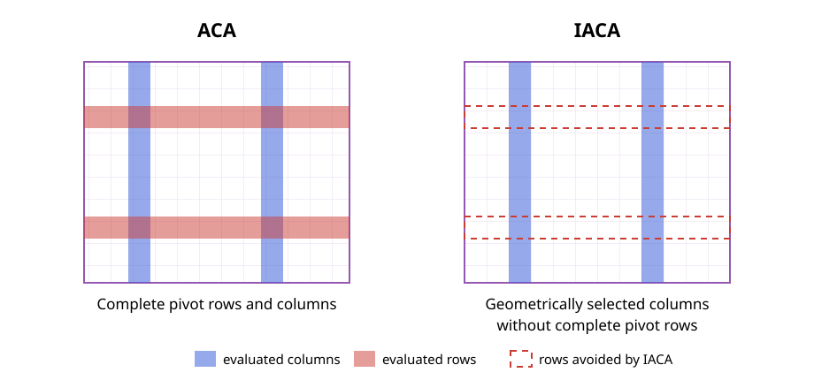

# Incomplete Adaptive Cross Approximation

Incomplete Adaptive Cross Approximation (IACA) selects the interpolation indices
needed for a nested low-rank representation while evaluating only one complete
side of the underlying interaction matrix. It replaces the value search on the
other side by a geometric prediction, avoiding matrix entries that standard ACA
computes only to locate its next pivot [[7]](@ref refs).

## Nested Low-Rank Approximation

Let $t$ be a cluster of $m$ row indices and let $F(t)$ contain the $n$ column
indices of its admissible interactions. The corresponding interaction matrix is

```math
\boldsymbol{\mathsf A}_{t,F(t)}
\in \mathbb{K}^{m\times n}.
```

Suppose that $I_t\subset t$ and $J_{F(t)}\subset F(t)$ are row and column pivot
sets of cardinality $k$. They define the skeleton approximation

```math
\boldsymbol{\mathsf A}_{t,F(t)}
\approx
\boldsymbol{\mathsf A}_{t,J_{F(t)}}
\boldsymbol{\mathsf A}_{I_t,J_{F(t)}}^{-1}
\boldsymbol{\mathsf A}_{I_t,F(t)}.
```

The first two factors determine a row-cluster basis,

```math
\boldsymbol{\mathsf U}_t
=
\boldsymbol{\mathsf A}_{t,J_{F(t)}}
\boldsymbol{\mathsf A}_{I_t,J_{F(t)}}^{-1},
```

and the transposed construction determines the corresponding column-cluster
basis. In a nested representation, the index sets are more important than an
independent low-rank factorization of every admissible block: parent and child
clusters reuse them to construct transfer and coupling matrices.

Standard ACA applied to $\boldsymbol{\mathsf A}_{t,F(t)}$ evaluates $k$ complete
columns and $k$ complete rows to obtain

```math
\widetilde{\boldsymbol{\mathsf A}}_{t,F(t)}
=\boldsymbol{\mathsf P}_k\boldsymbol{\mathsf Q}_k,
\qquad
\boldsymbol{\mathsf P}_k\in\mathbb{K}^{m\times k},
\quad
\boldsymbol{\mathsf Q}_k\in\mathbb{K}^{k\times n}.
```

The nested basis above does not require the complete factor
$\boldsymbol{\mathsf Q}_k$. IACA therefore constructs only

```math
\boldsymbol{\mathsf A}_{t,J_k}
\approx
\boldsymbol{\mathsf P}_k\boldsymbol{\mathsf B}_k,
\qquad
\boldsymbol{\mathsf B}_k\in\mathbb{K}^{k\times k},
```

where $J_k=\{j_1,\ldots,j_k\}$. The row-oriented variant exchanges the two
directions and constructs only the required $k\times n$ part.



## Incomplete Factorization

Consider the variant in which columns are selected geometrically. At iteration
$r$, the geometric strategy supplies $j_r\in F(t)$ without evaluating a residual
row. IACA evaluates the column $\boldsymbol{\mathsf A}_{t,j_r}$ and removes the
contributions of the previous pivots, producing the residual column

```math
\boldsymbol p_r
=
\boldsymbol{\mathsf A}_{t,j_r}
-\sum_{\ell=1}^{r-1} b_{\ell r}\boldsymbol p_\ell.
```

The corresponding row pivot is selected by partial pivoting,

```math
i_r
=\operatorname*{arg\,max}_{i\in t\setminus I_{r-1}}
|p_r(i)|.
```

The coefficients required to update later sampled columns are obtained at the
previous pivot rows,

```math
b_{\ell r}
=
\frac{
  A(i_\ell,j_r)
  -\displaystyle\sum_{q=1}^{\ell-1}p_q(i_\ell)b_{qr}
}{p_\ell(i_\ell)},
\qquad \ell<r,
```

with $b_{rr}=1$. Thus, $\boldsymbol{\mathsf P}_r$ contains complete residual
columns, whereas $\boldsymbol{\mathsf B}_r$ contains only the interpolation data
at the selected pivots. A complete residual row is never evaluated. The
row-geometric variant follows by transposition.

Because one pivot direction is predicted rather than found from residual values,
IACA may require slightly more pivots than ACA. Its advantage is that the number of
expensive matrix-entry evaluations no longer grows with the complete far-field set
on both sides.

## Mimicry Pivoting

The geometrically selected indices should reproduce the spatial distribution of
good algebraic pivots. Mimicry pivoting combines three observations about the
pivots selected by a fully pivoted ACA [[7]](@ref refs):

1. they cover the candidate set rather than concentrating in one region,
2. they favor its boundary, similarly to Leja points, and
3. they favor candidates close to the reference cluster.

Let $Z=\{\boldsymbol z_1,\ldots,\boldsymbol z_n\}$ be the candidate positions,
let $Z_{J_{r-1}}$ be the positions selected previously, and let
$\boldsymbol c_t$ be the centroid of the reference cluster. For $r>1$, define

```math
h_r(\boldsymbol z)
=\min_{\boldsymbol y\in Z_{J_{r-1}}}
  \lVert\boldsymbol z-\boldsymbol y\rVert_2,
```

```math
L_r(\boldsymbol z)
=\prod_{\boldsymbol y\in Z_{J_{r-1}}}
  \lVert\boldsymbol z-\boldsymbol y\rVert_2,
\qquad
w_t(\boldsymbol z)
=\frac{1}{\lVert\boldsymbol z-\boldsymbol c_t\rVert_2}.
```

The next geometrical pivot is

```math
j_r
=\operatorname*{arg\,max}_{j\notin J_{r-1}}
\left[
h_r(\boldsymbol z_j)
L_r(\boldsymbol z_j)^{2/(r-1)}
w_t(\boldsymbol z_j)^4
\right].
```

For $r=1$, only the proximity weight is available, so the point closest to the
reference centroid is selected. The minimum-distance factor promotes coverage,
the product-distance factor supplies the Leja-like boundary preference, and the
inverse-distance factor accounts for the stronger interaction with nearby
candidates. The exponents in the combined score are heuristic and were calibrated
numerically in the IACA study [[2, 7]](@ref refs).

[`MimicryPivoting`](@ref) implements this score directly on the candidate
positions. It is appropriate when the candidate set is small enough to inspect in
every iteration.

## Tree Mimicry Pivoting

For a large union of admissible clusters, evaluating the mimicry score at every
basis-function position can itself become expensive. Tree mimicry pivoting applies
the same score hierarchically:

1. evaluate the score at the centers of the candidate clusters,
2. select the best-scoring cluster,
3. repeat the selection among its children, and
4. evaluate the basis-function positions only after reaching a leaf.

The already selected set $Z_{J_{r-1}}$ always contains the actual
basis-function positions, even while candidate cluster centers are being scored.
Consequently, the tree search approximates the same geometric objective without a
flat search over the complete far field.

[`TreeMimicryPivoting`](@ref) implements this coarse-to-fine selection. In the
bottom-up nested construction it prevents pivot selection from becoming dominant
as the far-field candidate set grows and preserves linear construction complexity
under the assumptions stated below [[7]](@ref refs).

## Adapted Convergence Criterion

The standard ACA criterion cannot be evaluated because the complementary factor is
not available. Let $\boldsymbol{\mathsf R}_r$ denote the conceptual residual of
the rank-$r$ interpolant, even though IACA never forms this complete matrix.
Consider again the column-geometric variant after $r$ sampled columns. Treating
those columns as a deterministic sample of the complete interaction gives the
matrix-norm estimate

```math
\lVert\boldsymbol{\mathsf A}_{t,F(t)}\rVert_{\mathrm F}
\approx
\sqrt{\frac{n}{r}}
\lVert\boldsymbol{\mathsf A}_{t,J_r}\rVert_{\mathrm F}.
```

Similarly, the latest residual column gives

```math
\lVert\boldsymbol{\mathsf R}_r\rVert_{\mathrm F}
\approx
\sqrt{n}\,\lVert\boldsymbol p_r\rVert_2.
```

Substitution into the desired relative residual condition yields the one-sided
criterion

```math
\lVert\boldsymbol p_r\rVert_2
\leq
\frac{\varepsilon}{\sqrt r}
\lVert\boldsymbol{\mathsf A}_{t,J_r}\rVert_{\mathrm F}.
```

The estimates are heuristic because mimicry pivots are deterministic rather than
uniform random samples. In particular, a geometrically selected column may already
be represented well by the previous pivots. Its residual norm then drops suddenly
even though the complete interaction has not converged.

### Extrapolation Safeguard

To reject such isolated drops, define the estimated residual history

```math
\widehat\rho_\ell=\sqrt n\,\lVert\boldsymbol p_\ell\rVert_2,
\qquad \ell=1,\ldots,r-1,
```

and fit a polynomial $P_d$ to
$(\ell,\log\widehat\rho_\ell)$. A quadratic fit, $d=2$, is sufficient in the
numerical studies. With

```math
\widehat a_r
=\sqrt{\frac nr}
\lVert\boldsymbol{\mathsf A}_{t,J_r}\rVert_{\mathrm F},
```

convergence is accepted only if both the direct estimate above and

```math
P_2(r)\leq\log(\varepsilon\widehat a_r)
```

are satisfied. [`FNormExtrapolator`](@ref) implements this safeguard. Its internal
[`FNormEstimator`](@ref) maintains the one-sided scale from the sampled vector
norms without constructing the unavailable complementary factor.

[`PhaseExtrapolator`](@ref) extends the same idea to directionally filtered tree
pivoting. It requires the global history and the current directional phase to
predict convergence and accepts termination only after two consecutive successful
checks. This is an implementation extension; ordinary IACA uses
`FNormExtrapolator`.

### Tolerance in the Nested Construction

An $\mathcal{H}^2$ approximation reuses transfer matrices along paths through the
cluster tree, so interpolation errors can accumulate over the admissible levels.
If $L_{\mathrm{adm}}$ is the number of levels containing admissible interactions,
the IACA construction therefore applies the level-scaled local tolerance

```math
\varepsilon_{\mathrm{local}}
=\frac{\varepsilon}{L_{\mathrm{adm}}}.
```

This conservative scaling targets the requested global accuracy after the nested
bases have been assembled [[7]](@ref refs).

## Computational Cost

Assume a balanced binary cluster tree, a level-independent rank $k$, a bounded
number of admissible interactions per cluster, and that evaluating matrix entries
dominates the runtime. Under these assumptions:

- an ACA factorization of an $m\times n$ interaction evaluates
  $k(m+n)$ matrix entries;
- the corresponding IACA step evaluates only the required $m\times k$ factor and
  its $k\times k$ interpolation data, giving $k(m+k)$ evaluations in the model of
  [[7]](@ref refs); and
- the cost no longer depends directly on the size $n$ of the complete far-field
  union.

A straightforward top-down nested construction performs
$\mathcal{O}(N\log N)$ matrix-entry evaluations. In the bottom-up construction,
non-leaf clusters use only the pivots inherited from their children, reducing the
candidate side to a size proportional to $k$. Together with tree mimicry pivoting,
the resulting construction requires $\mathcal{O}(N)$ matrix-entry evaluations.
Both variants produce an $\mathcal{H}^2$ representation with
$\mathcal{O}(N)$ storage when the ranks remain bounded [[7]](@ref refs).

These estimates describe the electrically small or fixed-rank regime. If the
numerical rank grows with the problem size, the dependence on $k$ must be retained.
The top-down construction offers the more direct accuracy control. The bottom-up
construction is intended for the usual engineering tolerances; because it restricts
the parent candidates to child pivots, very stringent tolerances can expose an
additional approximation error.

For construction, buffer allocation, and interpretation of the returned indices,
see [Using Incomplete Adaptive Cross Approximation](../manual/iaca.md).
